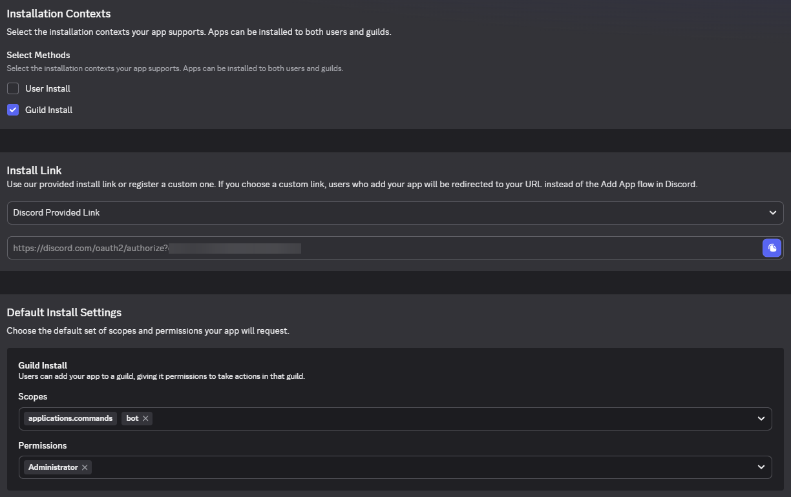

# Gateway Bot

---

- Powered by [Serenity](https://github.com/serenity-rs/serenity)
- Used to assist Discord admins with onboarding verification
- Created as a tool that will help you fight against spammers

### The goal
is to create a convenient tool to ease onboarding moderation
on a Discord server, to protect it from spammers without
AutoMod setup, which is also pretty restricted in its functionality.

## How it is intended to work:
1. Someone joins your Discord server.
2. They answer some onboarding questions without having access
   to the rest of the server.
3. Admins are making decision whether to verify they 
   and give the access to the server, or not.


## Usage / building from source:
1. **Clone the repository:**
   ```
   git clone 
   ```
2. **Build the repository:**
   </br></br>
   for regular usage:
   ```
   cargo build --release
   ```
   for developing:
   ```
   cargo build
   ```
   or use `cargo run`/`cargo run release`
   </br></br>
3. Create `.env` file and paste your bot's token there:
   ```
   DISCORD_TOKEN=...
   ```
4. Set up your `config.json`.
5. It's time to set up your Discord bot. Skip if it's already done.
6. Run the program.

## Discord bot setup:
1. [Visit Discord Developer Portal](https://discord.com/developers/applications) and create an application.
2. Navigate to the `Bot` section and `Reset Token`. Copy it.
3. Turn on the following Intents (still the `Bot` section):
   
4. Navigate to `Installation` tab, uncheck `User Install`, give necessary permissions:
   
5. Copy `Install link` and invite your bot somewhere.

## Config format:

```json5
{
  // the number of strings that will be chosen randomly
  "questions_number": 3, 
  // the category for channel creation
  "category_id": 1234567890123456789,
  // the string array itself
  "lines": [
    "first str",
    "second str",
    "third str",
    // and so on...
  ]
}
```

## Available commands:
- `!init` - send the initial message.